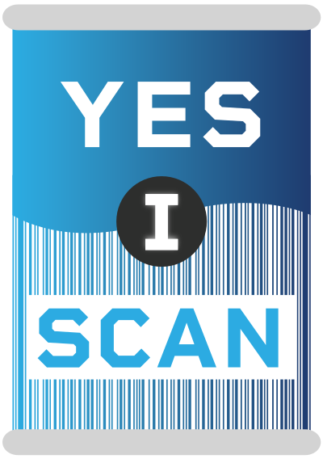
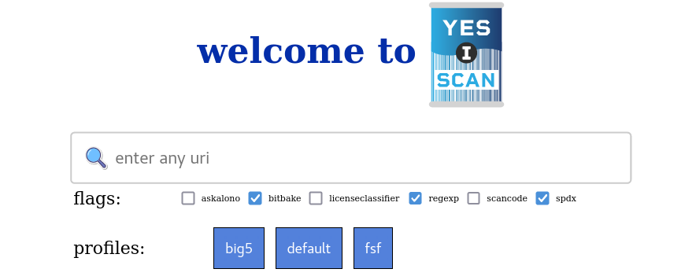
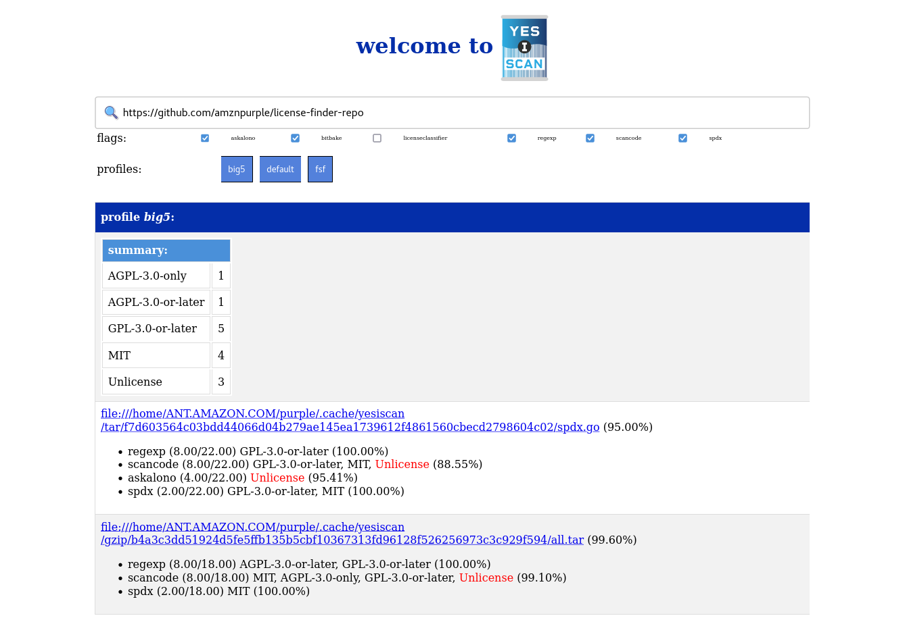
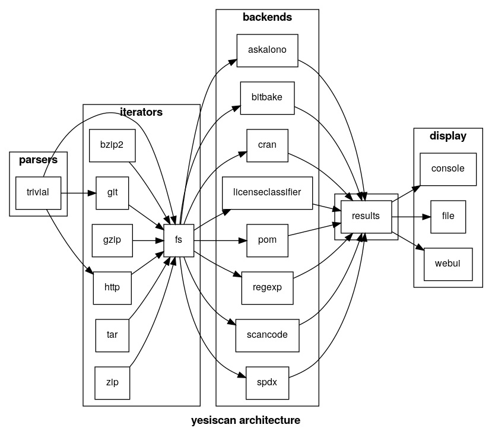
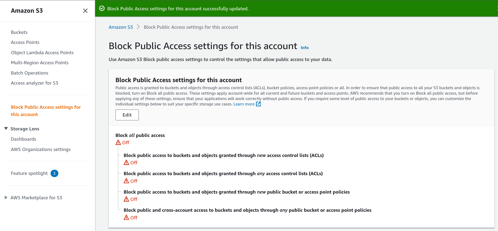

# *yesiscan*: license scanning tool

[](art/)

[](https://godoc.org/github.com/awslabs/yesiscan/)

## About

`yesiscan` is a tool for performing automated license scanning. It usually
takes a file path or git URL as input and returns the list of discovered license
information.

It does not generally implement any individual license identification algorithms
itself, and instead pulls in many different backends to complete this work for
it.

It has a novel architecture that makes it unique in the license analysis space,
and which can be easily extended.

If you choose to run it as a webui, the homepage looks like this:

[](art/webui.png)

<details>
<summary>The full results will then be shown like this.</summary>
	<a href="art/results.png"></a>
</details>

## Architecture

The `yesiscan` project is implemented as a library. This makes it easy to
consume and re-use as either a library, CLI, API, WEBUI, BOTUI, or however else
you'd like to use it. It is composed of a number of interfaces that roughly
approximate the logical design.

[](art/architecture.png)

### Parsers

Parsers are where everything starts. A parser takes input in whatever format
you'd like, and returns a set of iterators. (More on iterators shortly.) The
parser is where you tell `yesiscan` how to perform the work that you want. A
simple parser might simply expect a URI like `https://github.com/purpleidea/yesiscan/`
and error on other formats. A more complex parser might search through the text
of an email or chat room to look for useful iterators to build. Lastly, you
might prefer to implement a specific API that takes the place of a parser and
gives the user direct control over which iterators to create.

### Iterators

Iterators are self-contained programs which know how to traverse through their
given data. For example, the most well-known iterator is a file system iterator
that can recursively traverse a directory tree. Iterators do this with their
recurse method which applies a particular scanning function to everything that
it travels over. (More on scanning functions shortly.) In addition, the recurse
method can also return new iterators. This allows iterators to be composable,
and perform individual tasks succinctly. For example, the git iterator knows how
to download and store git repositories, and then return a new file system
iterator at the location where it cloned the repository. The zip iterator knows
how to decompress and unarchive zip files. The http iterator knows how to
download a file over https. Future iterators will be able to decompress tar and
gz archives, look inside rpm's, and so much more.

#### fs

The filesystem iterator knows how to find git submodules, zip files, and open
regular files for scanning. It is the cornerstone of all the iterators as we
eventually end up with an fs iterator to do the actual work.

#### zip

The zip iterator can decompress and extract zip files. It uses a heuristic to
decide whether a file should be extracted or not. It usually does the right
thing, but if you can find a corner case where it does not, please let us know.
It also handles java `.jar` and python `.whl` files since those are basically
zip files in disguise.

#### tar

The tar iterator can extract tar files. It uses a heuristic to decide whether a
file should be extracted or not. It usually does the right thing, but if you can
find a corner case where it does not, please let us know. It only extracts
regular files and directories. Symlinks and other special files will not be
extracted, nor will they be scanned as they have zero bytes of data anyways.

#### gzip

The gzip iterator can decompress gzip files. While the gzip format allows
multistream so that multiple files could exist inside one .gzip file, this is
not currently supported and probably not desired here. This does what you expect
and can match extensions like `.gz`, `.gzip`, and even `.tgz`. In the last case
it will create a new file with a `.tar` extension so that the tar iterator can
open it cleanly.

#### bzip2

The bzip2 iterator can decompress bzip and bzip2 files. This does what you
expect and can match extensions like `.bz`, `.bz2`, `.bzip2`, and even `.tbz`
and `.tbz2`. In the last two cases it will create a new file with a `.tar`
extension so that the tar iterator can open it cleanly.

#### http

The http iterator can download files from http sources. Because many git sources
actually present as https URL's, we use a heuristic to decide what to download.
If you aren't getting the behaviour you expect, please let us know. Plain http
(not https) urls are disabled by default.

#### git

The git iterator is able to recursively clone all of your git repository needs.
It does this with a pure-golang implementation to avoid you needing a special
installation on your machine. This correctly handles git submodules, including
those which use relative git submodule URLs. There is currently a small bug or
missing feature in the pure-golang version, and for compatibility with _all_
repositories, we currently make a single exec call to `git` in some of those
cases. As a result, this will use the `git` binary that is found in your $PATH.

### Scanning

The scanning function is the core place where the coordination of work is done.
In contrast to many other tools that perform file iteration and scanning as part
of the same process or binary, we've separated these parts. This is because it
is silly for multiple tools to contain the same file iteration logic, instead of
just having one single implementation of it. Secondly, if we wanted to scan a
directory with two different tools, we'd have to iterate over it twice, read the
contents from disk twice, and so on. This is inefficient and wasteful if you are
interested in analysis from multiple sources. Instead, our scanning function
performs the read from disk that all our different backends (if they support it)
can use, and so this doesn't need to necessarily be needlessly repeated. (More
on backends shortly.) The data is then passed to all of the selected backends in
parallel. The second important part of the scanning function is that it caches
results in a datastore of your choice. This is done so that repeated queries do
not have to perform the intensive work that is normally required to scan each
file. (More on caching shortly.)

### Backends

The backends perform the actual license analysis work. The `yesiscan` project
doesn't really implement any core scanning algorithms. Instead, we provide a way
to re-use all the existing license scanning projects out there. Ideal backends
will support a small interface that lets us pass byte array pointers in, and get
results out, but there are additional interfaces that we support if we want to
reuse an existing tool that doesn't support this sort of modern API. Sadly, most
don't, because most software authors focus on the goals for their individual
tool, instead of a greater composable ecosystem. We don't blame them for that,
but we want to provide a mechanism where someone can write a new algorithm, drop
it into our project, and avoid having to deal with all the existing boilerplate
around filesystem traversal, git cloning, archive unpacking, and so on. Each
backend may return results about its analysis in a standard format. (More on
results shortly.) In addition to the well-known, obvious backends, there are
some "special" backends as well. These can import data from curated databases,
snippet repositories, internal corporate ticket systems, and so on. Even if your
backend isn't generally useful worldwide, we'd like you to consider submitting
and maintaining it here in this repository so that we can share ideas, and
potentially get new ideas about design and API limitations from doing so.

#### Google License Classifier

The google license classifier backend wraps the [google license classifier](https://github.com/google/licenseclassifier)
project. It is a pure golang backend which is nice, although the API does use
files on disk for intermediate processing which is suboptimal for most cases,
although makes examination of incredibly large files possible. Some of the
results are spurious so use it with a lower confidence interval.

#### Cran

Cran is a backend for `DESCRIPTION` files which are text files to store
important [R](https://www.r-project.org/) package metadata. It finds names of
licenses in the `License` field of the text file.

#### Pom

Pom is a backend for parsing Project Object Model or POM files. It finds names
of licenses in the `licenses` field of the `pom.xml` file which are commonly
used by the Maven Project. This parser sometimes cannot identify licenses due to
the name being written in its full form.

#### Spdx

This is a simple pure-golang, SPDX parser. It should find anything that is a
valid SPDX identifier. It was written from scratch for this project since the
upstream version wasn't optimal. It shouldn't have any bugs, but if you find
any issues, please report them!

#### Askalono

This wraps the [askalono](https://github.com/jpeddicord/askalono/) project which
is written in rust. It shells out to the binary to accomplish the work. There's
no reason this couldn't be easily replaced with a pure-golang version, although
we decided to use this because it was already built and it serves as a good
example on how to write a backend that runs an exec. Due to a limitation of the
tool, it cannot properly detect more than one license in a file at a time. As a
result, benefit from its output, but make sure to use other backends in
conjunction with this one. The `askalono` binary needs to be installed into your
`$PATH` for this to work. To install it run: `cargo install askalono-cli`. It
will download and build a version for you and put it into `~/.cargo/bin/`.
Either add that directory to your `$PATH` or copy the `askalono` binary to
somewhere appropriate like `~/bin/`.

#### Scancode

This wraps the [ScanCode](https://github.com/nexB/scancode-toolkit) project
which is written mostly in python. It is a venerable project in this space, but
it is slower than the other tools and is a bit clunky to install. To install it
first download the latest release, then extract it into `/opt/scancode/` and
then add a symlink to main entrypoint in your `~/bin/` so that it shows up in
your $PATH where we look for it. Run it with `--help` once to get it to
initialize if you want. This looks roughly like this:

```
wget https://github.com/nexB/scancode-toolkit/releases/download/v30.1.0/scancode-toolkit-30.1.0_py36-linux.tar.xz
tar -xf scancode-toolkit-30.1.0_py36-linux.tar.xz
sudo mv scancode-toolkit-30.1.0/ /opt/scancode/
cd ~/bin/ && ln -s /opt/scancode/scancode
cd - && rm scancode-toolkit-30.1.0_py36-linux.tar.xz
scancode --help
```

In the future a more optimized scancode backend could be written to improve
performance when running on large quantities of files, using the directory
interface, and also perhaps even spawning it as a server. Re-writing the core
detection algorithm in golang would be a valuable project.

#### Bitbake

Bitbake is a build system that is commonly used by the yocto project. It has
these `.bb` metadata files that contain `LICENSE=` tags. This backend looks for
them and includes them in the result. It tries to read them as SPDX ID's where
possible.

#### Regexp

Regexp is a backend that lets you match based on regular expressions. Nobody
likes to do this, but it's very common. Put a config file at
`~/.config/yesiscan/regexp.json` and then run the tool. An example file can be
found in `[examples/regexp.json](examples/regexp.json)`. You can override the
default path with the `--regexp-path` command line flag.

### Caching

The caching layer will be coming soon! Please stay tuned =D

### Results

Each backend can return a result "struct" about what it finds. These results are
collected and eventually presented to the user with a display function. (More on
display functions shortly.) Results contain license information (More on
licenses shortly.) and other data such as confidence intervals of each
determination.

### Display Functions

Display functions show information about the results. They can show as much or
as little information about the results as they want. At the moment, only a
simple text output display function has been implemented, but eventually you
should be able to generate beautiful static html pages (with expandable sections
for when you want to dig deeper into some analysis) and even send output as an
API response or to a structured file.

### Licenses

Licenses are the core of what we usually want to identify. It's important for
most big companies to know what licenses are in a product so that they can
comply with their internal license usage policies and the expectations of the
licenses. For example, many licenses have attribution requirements, and it is
usually common to include a `legal/NOTICE` file with these texts. It's also
quite common for large companies to want to avoid the `GPL` family of licenses,
because including a library under one of these licenses would force the company
to have to release the source code for software using that library, and most
companies prefer to keep their source proprietary. While some might argue that
it is idealogically or ethically wrong to consume many dependencies and benefit
financially, without necessarily giving back to those projects, that discussion
is out of scope for this project, please have it elsewhwere. This project is
about "knowing what you have". If people don't want to have their dependencies
taken and made into proprietary software, then they should choose different
software licenses! This project contains a utility library for dealing with
software licenses. It was designed to be used independently of this project if
and when someone else has a use for it. If need be, we can spin it out into a
separate repository.

## Building

Make sure you've cloned the project with `--recursive`. This is necessary
because the project uses git submodules. The project also uses the `go mod`
system, but the author thinks that forcing developers to pin dependencies is a
big mistake, and prefers the `vendor/`+ git submodules approach that was easy
with earlier versions of golang. If you forgot to use `--recursive`, you can
instead run `git submodule init && git submodule update` in your project git
root directory to fix this. To then build this project, you will need golang
version `1.17` or greater. To build this project as a CLI, you will want to
enter the `cmd/yesiscan/` directory and first run `go generate` to set the
program name and build version. You can then produce the binary by running
`go build`.

## Usage

### CLI

Just run the binary with whatever input you want. For example:

```bash
yesiscan https://github.com/purpleidea/mgmt/
```

### Web

Just run the binary in `web` mode. Then you can launch your web browser and use
it normally. For example:

```bash
yesiscan web
xdg-open http://localhost:8000/
```

### Config

You can store your default configuration options in a
`~/.config/yesiscan/config.json` file. This location can be overridden by the
`--config-path` argument. If this file exists, then these values will be used as
defaults. The below flags can override any of these. The following keys are
supported: `auto-config-uri`, `auto-config-cookie-path`, `quiet`, `regexp-path`,
`output-type`, `output-path`, `output-s3bucket`, `region`, `profiles`, and
`backends`. These keys should all be the top-level keys in a single json
dictionary. More information on some of these keys are described below.

#### "profiles"

This key should be a list of "profiles" to use. See the **Profiles** section
below for more information.

#### "backends"

These keys should be a dictionary of backend names to boolean `true` or `false`
values representing the enabled state of that backend. If you don't specify a
backend here, then whether or not that backend will be enabled or not is
undefined and will depend on which backend flags you use. As a result, it is
always recommended to be explicit about which backends you want to enable.

### Flags

You can add flags to tell it which backends to include or remove. They're all
included by default unless you choose which one to exclude with the
`--no-backend` variants. However if you use any of the `--yes-backend` variants,
then you have to specify each backend that you want individually. You can get
the full list of these flags with the `--help` flag.

#### --auto-config-uri
This is a special URI which if set, will try and pull a config from that
location on startup. It will use the cookie file stored at
`--auto-config-cookie-path` if specified. If successful, it will check if the
config is different from what is currently stored. If so then it will validate
if it is a valid json config. If so it will replace (overwrite!) the current
config and then run with that!

For example: `--auto-config-uri 'https://example.com/config.json'`.

#### --auto-config-cookie-path
This is a special URI which if set will point to a netscape/libcurl style cookie
file to use when making the get download requests. This is useful if you store
your config behind some gateway that needs a magic cookie for auth. It accepts
the tilde (`~`) character to use for `$HOME` directory path expansion.

For example:  `--auto-config-cookie-path '~/.secret/cookie'`.

#### --quiet

When this boolean flag is enabled, all log messages will be suppressed.

#### --regexp-path
This is the path to the regexp rules files as used by the regexp backend. If it
is not specified, then we will automatically look for a file in
`~/.config/yesiscan/regexp.json`.

#### --config-path
This is the path to the main `config.json` file. If it is not specified, then we
will automatically look for a file in `~/.config/yesiscan/config.json`.

#### --output-type

When run with `--output-type html` the scan results will be output in html. When
run with `--output-type text` the scan results will be in plain text. This
requires that you also specify `--output-path` or `--output-s3bucket`. If you
don't specify this, it will default to `html`.

#### --output-path

When run with `--output-path <path>` the scan results will be saved to a file.
This will overwrite whatever file contents are already there, so please use
carefully. If you specify `-` as the file path, the stdout will be used. This
will also cause the quiet flag to be enabled.

#### --output-s3bucket

If you specify this flag with the name of an AWS S3 bucket, then the report will
be uploaded to this location. You must have previously created an AWS account
and have installed the credentials triple to the machine where you are running
this tool. It is recommended that you use a dedicated (not shared) S3 bucket
with this tool, as it will control the internal namespace and could potentially
overwrite a file that you have already stored there. After the file is written,
it will return a presigned URL that you can share with others. It will also
return a public URL that you can share as well. This URL will only work if you
have public access settings configured for your bucket. To configure those, you
can refer to the below settings. The public object URL's that are generated are
pseudo-hard to guess, but not impossible. The advantage they have over the
presigned URL's is that they don't expire, where as the presigned URL's expire
after seven days. This is an Amazon imposed limit.

<details>
<summary>Public access settings you may or may not want to set.</summary>
	<a href="s3/screenshot-s3-public-bucket.png"></a>
	For more info please refer to the
	[AWS docs](https://docs.aws.amazon.com/AmazonS3/latest/userguide/configuring-block-public-access-account.html).
</details>

#### --region
This is the S3 region that is used for uploading files to S3 buckets.

#### --profile

This flag may be used multiple times to enable different profiles. This is used
by both the regular cli and also the web variant. The profiles system is
described below.

### Profiles

Most users might want to filter their results so that not all licenses are
shown. For this you may specify one or more `--profile <name>` parameters. If
the `<name>` corresponds to a `<name>.json` file in your
`~/.config/yesiscan/profiles/` directory, then it will use that file to render
the profile. The contents of that file should be in a similar format to the
example file in `[examples/profile.json](examples/profile.json)`. You get to
pick a comment for personal use, a list of SPDX license ID's, and whether this
is an exclude list or an include list. If you don't specify any profiles you
will get the default profile. It is also a built-in name so you can add in this
profile to your above set by doing `--profile default` and if there is no such
user-defined profile, then the default will be displayed.

### Bash Auto Completion

If you source the bash-autocompletion stub, then you will get autocompletion of
the common flags! Download the stub from [https://github.com/urfave/cli/blob/main/autocomplete/bash_autocomplete](https://github.com/urfave/cli/blob/main/autocomplete/bash_autocomplete) and put it somewhere like
`/etc/profile.d/yesiscan`. The name of the file must match the name of the
program! Things should just work, but if they don't, you may want to add a stub
in your `~/.bashrc` like:

```bash
# force yesiscan bash-autocompletion to work
if [ -e /etc/profile.d/yesiscan ]; then
	source /etc/profile.d/yesiscan
fi
```

## Style Guide

This project uses `gofmt -s` and `goimports -s` to format all code. We follow
the [mgmt style guide](https://github.com/purpleidea/mgmt/blob/master/docs/style-guide.md#overview-for-golang-code)
even though we don't yet have all the automated tests that the `mgmt config`
project does. Commit messages should start with a short, lowercase prefix,
followed by a colon. This prefix should keep things organized a bit when
perusing logs.

## Legal

Copyright Amazon.com Inc or its affiliates and the yesiscan project contributors
Written by James Shubin <purple@amazon.com> and the project contributors

Licensed under the Apache License, Version 2.0 (the "License"); you may not use
this file except in compliance with the License. You may obtain a copy of the
License at

http://www.apache.org/licenses/LICENSE-2.0

Unless required by applicable law or agreed to in writing, software distributed
under the License is distributed on an "AS IS" BASIS, WITHOUT WARRANTIES OR
CONDITIONS OF ANY KIND, either express or implied. See the License for the
specific language governing permissions and limitations under the License.

We will never require a CLA to submit a patch. All contributions follow the
`inbound == outbound` rule.

This is not an official Amazon product. Amazon does not offer support for this
project.

## Authors

[James Shubin](https://purpleidea.com/), while employed by Amazon.ca, came up
with the initial design, project name, and implementation. James had the idea
for a soup can as the logo, which [Sonia Xu](https://www.soniaxu.net/)
implemented beautifully. She had the idea to do the beautiful vertical lines and
layout of it all.

Happy hacking!
